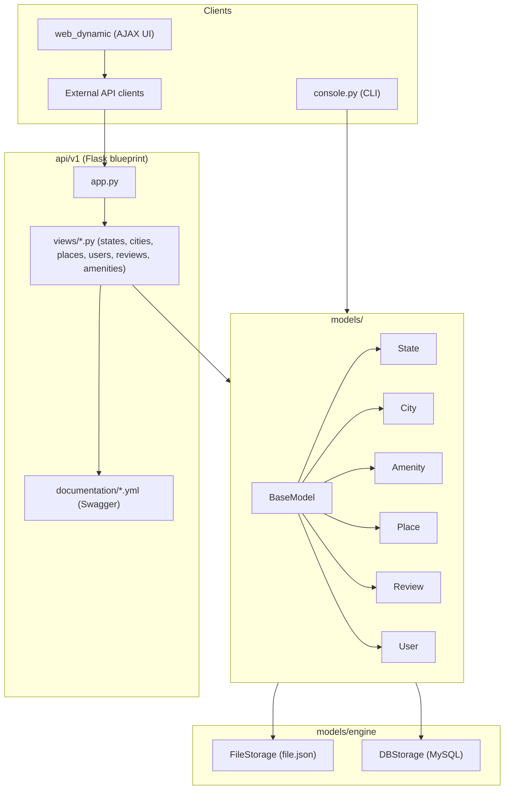

# AirBnB Clone v4

The final and most complete stage of the ALX/Holberton AirBnB clone series. It combines the original console and data model with a full RESTful JSON API built on Flask, Swagger/Flasgger auto-generated API docs, and both static and dynamic (JavaScript/jQuery-driven) front ends, all backed by a storage layer that can switch between a JSON file and a MySQL database.

  

> This repository started as a fork of [jzamora5/AirBnB_clone_v3](https://github.com/jzamora5/AirBnB_clone_v3) for a Holberton/ALX group project and was extended independently with additional API, storage, and front-end work.

## Features

- Interactive `cmd`-based console (`console.py`) with full CRUD support for all model classes
- RESTful API (`api/v1/`) built with Flask and organized as a blueprint, exposing `GET`/`POST`/`PUT`/`DELETE` endpoints for `State`, `City`, `Amenity`, `Place`, `Review`, and `User`
- `/api/v1/status` health check and `/api/v1/stats` object-count endpoint
- Auto-generated interactive API documentation via Flasgger/Swagger (YAML specs under `api/v1/views/documentation/`)
- CORS enabled on all `/api/v1/*` routes via `flask-cors`
- Dual storage engines (`FileStorage` for JSON, `DBStorage` for MySQL via SQLAlchemy), selected through environment variables, with a shared interface: `all`, `new`, `save`, `delete`, `get`, `count`, `reload`
- Flask-based dynamic web app (`web_dynamic/`) rendering places with AJAX filtering (`static/scripts/`)
- Static HTML/CSS front-end prototypes (`web_static/`) and standalone Flask learning exercises (`web_flask/`)
- Deployment helper scripts (`0-setup_web_static.sh`, `1-pack_web_static.py`, `2-do_deploy_web_static.py`, `3-deploy_web_static.py`) for packaging and deploying the static site to remote servers
- Unit tests for models, console, and both storage engines (`tests/`)

## Tech Stack

- Python 3
- Flask, Flask-CORS, Flasgger (Swagger UI)
- SQLAlchemy ORM + MySQL
- JavaScript / jQuery (dynamic front end)
- HTML5 / CSS3
- Fabric-style deployment scripts (SSH-based static site packaging/deployment)
- `unittest` for automated testing

## Project Structure

```
console.py                     Command interpreter entry point
models/base_model.py           BaseModel: shared attrs, SQLAlchemy Base, to_dict/save/delete
models/{state,city,amenity,    Model classes, dual-mode (SQLAlchemy columns or plain attrs)
  place,review,user}.py         depending on the active storage engine
models/engine/file_storage.py  FileStorage: JSON persistence engine
models/engine/db_storage.py    DBStorage: SQLAlchemy/MySQL persistence engine, with get()/count()
api/v1/app.py                   Flask application factory: CORS, Swagger config, error handlers
api/v1/views/                   Blueprint route modules, one per resource (states, cities, places, ...)
api/v1/views/documentation/     Swagger/Flasgger YAML specs per endpoint
web_flask/                      Standalone Flask exercises (routes, templates, filters)
web_dynamic/                    AJAX-driven place listing app (Flask + JS)
web_static/                     Static HTML/CSS prototypes of the listing page
tests/                           Unit tests for models, console, and storage engines
setup_mysql_dev.sql / _test.sql Database provisioning scripts
```

## Architecture

The API layer sits on top of the same `BaseModel`-derived class hierarchy used across the series; each model is either a SQLAlchemy-mapped table or a plain in-memory object depending on `HBNB_TYPE_STORAGE`, and the Flask blueprint routes talk only to the shared `storage` interface.



## Installation

```bash
git clone https://github.com/OmarElzero/AirBnB_clone_v4.git
cd AirBnB_clone_v4
pip3 install flask flask-cors flasgger sqlalchemy mysqlclient
```

For MySQL storage, provision the database first:

```bash
cat setup_mysql_dev.sql | mysql -hlocalhost -uroot -p
```

## Usage

Start the interactive console:

```bash
./console.py
```

Run the REST API (defaults to `0.0.0.0:5000`, interactive docs at `/apidocs`):

```bash
HBNB_MYSQL_USER=hbnb_dev HBNB_MYSQL_PWD=hbnb_dev_pwd \
HBNB_MYSQL_HOST=localhost HBNB_MYSQL_DB=hbnb_dev_db \
HBNB_TYPE_STORAGE=db HBNB_API_HOST=0.0.0.0 HBNB_API_PORT=5000 \
python3 -m api.v1.app
```

Example API calls:

```bash
curl http://0.0.0.0:5000/api/v1/status
curl http://0.0.0.0:5000/api/v1/states
curl -X POST http://0.0.0.0:5000/api/v1/states \
  -H "Content-Type: application/json" -d '{"name": "California"}'
```

Run the dynamic web app:

```bash
python3 web_dynamic/0-hbnb.py
```

## Demo

No live demo is available for this project.

## Testing

```bash
python3 -m unittest discover tests
```

---

**Author:** OmarElzero · [GitHub](https://github.com/OmarElzero)
_Last updated: 2026-08-23_
